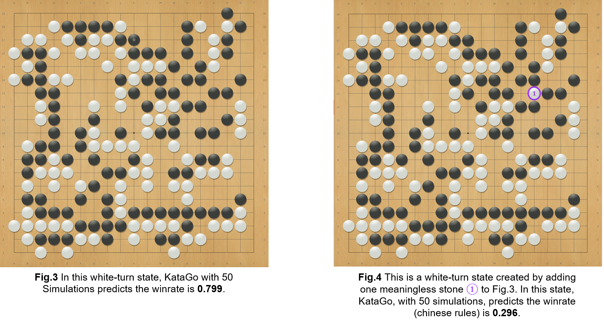
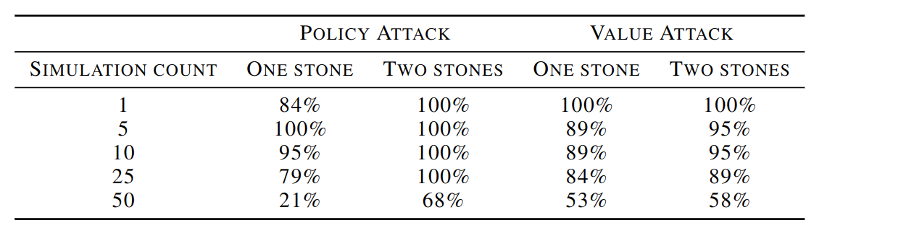
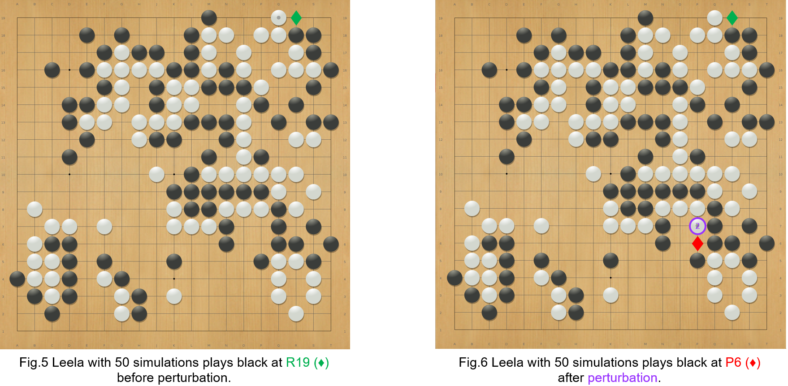
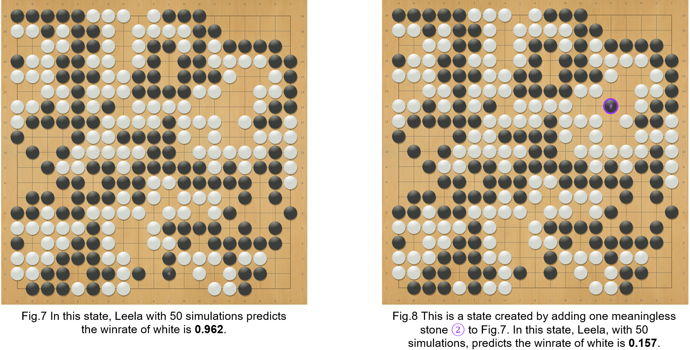
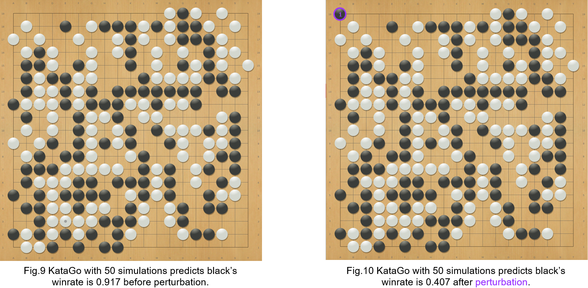
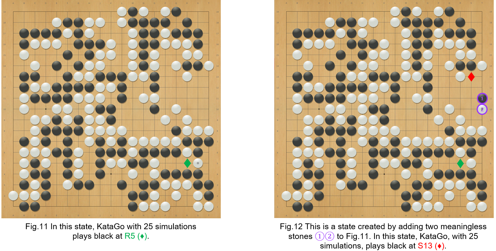
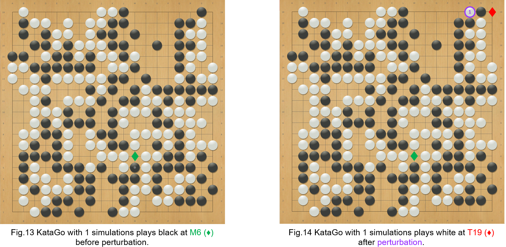
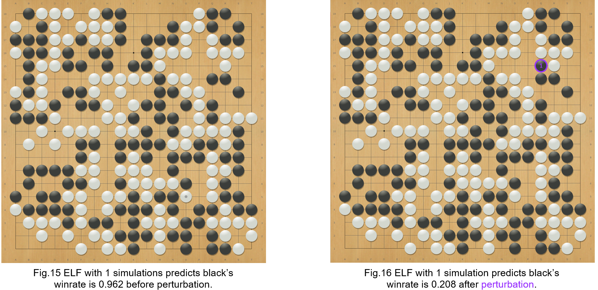

# Adversarial Example of Go
-----

## Overview

[中文簡介](https://github.com/lan-lc/adversarial_example_of_Go/blob/main/chineseREADME.md)

This repository contains a reference implementation of finding adversarial examples for Go Agents. Our paper 
(Li-Cheng Lan, Huan Zhang, Ti-Rong Wu, Meng-Yu Tsai, I-Chen Wu, and Cho-Jui Hsieh.
"Are AlphaZero-like Agents Robust to
Adversarial Perturbations?") is accepted by Neurips 2022. 

Can well-trained Go agents make trivial mistakes that even humans can easily tell? In our paper, we attack famous Go agents like [KataGo](https://github.com/lightvector/KataGo), [LeelaZero](https://github.com/leela-zero/leela-zero), [ELF](https://github.com/pytorch/ELF), and [CGI](https://arxiv.org/abs/2003.06212) by systematically finding adversarial states such that the target Go agent will make trivial mistakes. This is inspired by the literature of [adversarial attack](https://arxiv.org/pdf/1412.6572.pdf), where researchers found neural networks can be easily fooled by adding some human imperceptible perturbation to the input. 

Given a natural state from a game record where the target Go agent can find a winning move, we generate an adversarial state by adding one or two meaningless stones such that the Go agent will play an undoubtedly inferior action and eventually lose the game. The errors made by the target models are obvious, even for Go beginners. Fig.2 shows one of the examples we found. 

<!--  -->


The state in Fig. 2 is created by adding $\color{#9933FF} \text{two stones}$ (marked as $\color{#9933FF} \text{1}$ and $\color{#9933FF} \text{2}$) to a natural state (Fig. 1) of AlphaGo Zero self-play record. 
Even amateur players know that the $\color{#9933FF} \text{two stones}$ are meaningless since they will not affect the winrate nor the best action of the state in Fig 1. 
The best action of both states is playing black at position $\color{green} \text{E1 ◆}$ since by playing $\color{green} \text{E1 ◆}$ black can kill all the white stones that are marked with blue triangles.
However, in Fig.2, the KataGo agent will want to play black at position $\color{red} \text{E11 ◆}$ instead of position $\color{green} \text{E1 ◆}$ even after executing 50 MCTS simulations. Although playing black at $\color{red} \text{E11 ◆}$ can save the four black stones marked with squares,  even amateur human players can tell that killing the white stones marked with triangles is way more important.
To understand how KataGo makes this mistake,  we list the node information of the MCTS first layer at the right of Fig. 2.
The first column is the node's action. The second column is the number of MCTS simulations of each node. The third column is the predicted winrate of each node. According to the list, we can see that KataGo did consider the position $\color{green} \text{E1 ◆}$ once. However, since the predicted winrate of that simulation is too low, KataGo stops exploring $\color{green} \text{E1 ◆}$. 

Besides making the agent outputs a wrong action, we also find examples that make the agent predict a wrong winrate. Fig. 3 4 shows an example of attacking the winrate of Leela with 50 simulations. 



The state in Fig. 4 is created by adding a $\color{#9933FF} \text{black stone (2)}$ to the natural state in Fig. 3. Although the additional  $\color{#9933FF} \text{black stone (2)}$ is obviously meaningless, Leela outputs two totally different winrates in two states.
Even amateur human players can tell that one of the winrates is wrong since the additional $\color{#9933FF} \text{black stone}$ shouldn't change the winrate. (See more examples in [Adversarial Examples](#adversarial-examples) )


To find the adversarial examples shown in Fig. 2 and Fig.4, we carefully designed the constraints on perturbed states during the search so that they are semantically similar to the original states and are also easy enough for human players to verify the correct move. Next, we test AZ agents with thousands of these perturbed
states to see if they will make trivial mistakes. We also design an efficient algorithm to make the testing faster. Usually, our method is 100 times faster than brute force search. The following table shows the results of attacking KataGo with AlphaGo Zero self-play games.



The first column shows the number of MCTS simulations used by KataGo. The second and the third columns show the success rate of making KataGo outputs a bad action. The third and fourth columns show the success rate of making KataGo output an extremely wrong winrate. We can see that as the number of simulations increases, KataGo becomes harder to attack. However, even with 50 simulations, we can still find policy adversarial examples in 68% of the AlphaGo Zero self-play games. 

 

Our codes also aim to be a useful and lightweight analysis tool for Go players and developers and support the following features:
- Able to connect different agents on different machines through ports.
- Able to conduct our attack on the Go program that supports GTP (https://senseis.xmp.net/?GoTextProtocol). 
- Able to save and load the MCTS and NN results of a program.
- Able to let two agents play against each other.
- Able to store the analysis results in an SGF file.

## Setup


```bash
git clone git@github.com:lan-lc/adversarial_example_of_Go.git
cd adversarial_example_of_Go
sudo docker run --gpus all --network="host" --ipc=host -it -v=$PWD:/workspace kds285/go-attack
mkdir build
cd build
cmake ..
make -j
```
### KataGo
```bash
# run container
sudo docker run --gpus all --network="host" --ipc=host -it kds285/katago
# run program with gogui-server
gogui-server -port 9999 -loop "./katago gtp -model kata1-b40c256-s9948109056-d2425397051.bin.gz -config gtp_example.cfg"
# run program (20 blocks) with gogui-server
gogui-server -port 9999 -loop "./katago gtp -model kata1-b20c256x2-s5303129600-d1228401921.bin.gz -config gtp_example.cfg"
```
### Leela
```bash
# run container
sudo docker run --network="host" --ipc=host -it kds285/leelazero:go_attack
# run program with gogui-server
echo "./leelaz --gtp --threads 1 --noponder --visits 800 --resignpct 0 --timemanage off --gpu \$1 2>/dev/null" > run_gtp.sh
chmod +x run_gtp.sh
gogui-server -port 9998 -loop "./run_gtp.sh 0"
```
### ELF
```bash
# run container
sudo docker run --network="host" --ipc=host -it kds285/elf-opengo:go_attack
# run program with gogui-server
echo "./gtp.sh /go-elf/ELF/pretrained-go-19x19-v2.bin --verbose --gpu \$1 --num_block 20 --dim 256 --mcts_puct 1.50 --batchsize 8 --mcts_rollout_per_batch 8 --mcts_threads 2 --mcts_rollout_per_thread 400 --resign_thres 0 --mcts_virtual_loss 1 2>&1 | grep --line-buffered \"^= \|custom_output\" | awk '{ if(\$1==\"[custom_output]\") { print \$0; } else { print \$0\"\n\"; system(\"\"); } }'" > run_gtp.sh
chmod +x run_gtp.sh
gogui-server -port 9997 -loop "./run_gtp.sh 0"
```
### CGI
```bash
sudo docker --network="host" --ipc=host -it kds285/cgigo:go_attack
# build program
./scripts/setup-cmake.sh release caffe2 && make -j
# run program with gogui-server
gogui-server -port 9999 "Release/CGI -conf_file cgi_example.cfg"
```

## Adversarial Examples
The following pictures show some of the adversarial examples we found. For each pair of pictures, the left is the natural state, and the right is the perturbed state. More examples are shown in the [examples](https://github.com/lan-lc/adversarial_example_of_Go/tree/main/examples) folder.








