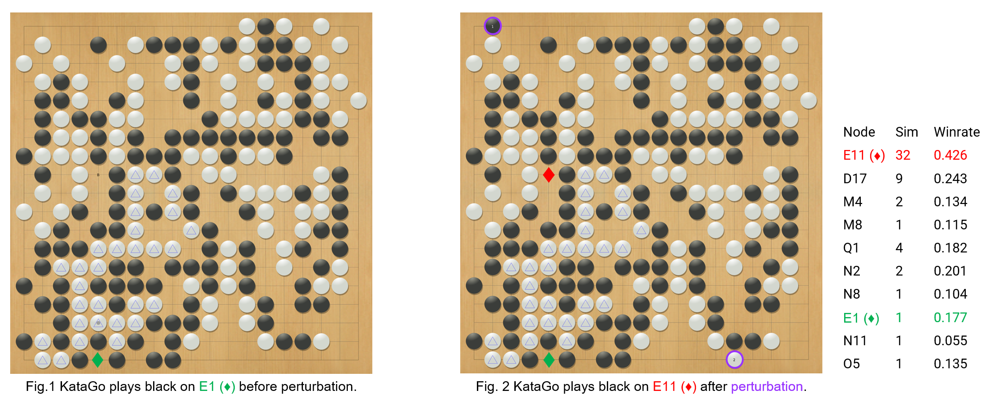
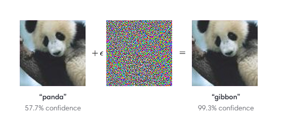

# Adversarial_Example_of_Go
------
## Overview
This repository contains a reference implementation of finding adversarial examples for Go Agents.

In our paper, we attack famous Go agents like [KataGo](https://github.com/lightvector/KataGo), [LeelaZero](https://github.com/leela-zero/leela-zero), [ELF](https://github.com/pytorch/ELF), and [CGI](https://arxiv.org/abs/2003.06212) by systematically finding states that the agent are wrong but amateur human players are correct. Fig.2 shows one of the examples we found. 



In this state, KataGo agent, one of the best AZ agents, will want to play black at position <span style="color:red">E11 ◆</span> instead of postion <span style="color:green">E1 ◆</span> even after executing 50 MCTS simulations. Even amateur human players can tell that position <span style="color:green">E1 ◆</span> is the best action since black can kill the white stones that are marked with blue triangle. We also list the node information of the MCTS first layer at the right of Fig. 2. The first colomn is the action of the node. The second colomn is the number of MCTS simulations of each node. The third colomn is the predicted winrate of each node. According to the list, we can see that KataGo did consider the position <span style="color:green">E1 ◆</span>. However, since the predicted winrate is low, KataGo stop exploring <span style="color:green">E1 ◆</span> and keep exploiting <span style="color:red">E11 ◆</span>. 

Our method is inspired by [adversarial attack](https://arxiv.org/pdf/1412.6572.pdf), which creates adversarial examples by minimally perturbing a natural example. The following picture is a famous [example](https://arxiv.org/pdf/1412.6572.pdf).



In this example, researchers make the target model make a wrong prediction by adding some noise. Similar to the panda example, Fig. 2 is created by a adding <span style="color:lightblue"> two stones (marked as 1 and 3) </span> to a nature state (Fig. 1) of AlphaGo Zero self-play record. Even amateur players know that the <span style="color:lightblue"> two stones </span> are meaningless since they will not affect the winrate nor the best action. 
However, confused by those two stones, KataGo will switch its answer from <span style="color:green">E1 ◆</span> to <span style="color:red">E11 ◆</span>. More examples are shown in [examples](#adversarial-examples). After carefully design the search space and improve the searching efficiency, our method can find the adversarial examples of KataGo with 50 MCTS simluations of 68% of the self-play record. Moreover, more than 80% of the mistakes can be easily understanded by amateur player. 


Our codes also aims to be a useful analyze tool for Go players and developers, and supports the following features:
- Able to attack any Go program that supports GTP (https://senseis.xmp.net/?GoTextProtocol). 
- Able to save and load the MCTS and NN results of a program.
- Allowing different agents to play against each other.


## Setup


```bash
git clone git@github.com:lan-lc/adversarial_example_of_Go.git
cd adversarial_example_of_Go
sudo docker run --gpus all --network="host" --ipc=host -it -v=$PWD:/workspace kds285/go-attack
mkdir build
cd build
cmake ..
make -j
```
### KataGo
```bash
# run container
sudo docker run --gpus all --network="host" --ipc=host -it kds285/katago
# run program with gogui-server
gogui-server -port 9999 -loop "./katago gtp -model kata1-b40c256-s9948109056-d2425397051.bin.gz -config gtp_example.cfg"
# run program (20 blocks) with gogui-server
gogui-server -port 9999 -loop "./katago gtp -model kata1-b20c256x2-s5303129600-d1228401921.bin.gz -config gtp_example.cfg"
```
### Leela
```bash
# run container
sudo docker run --network="host" --ipc=host -it kds285/leelazero:go_attack
# run program with gogui-server
echo "./leelaz --gtp --threads 1 --noponder --visits 800 --resignpct 0 --timemanage off --gpu \$1 2>/dev/null" > run_gtp.sh
chmod +x run_gtp.sh
gogui-server -port 9998 -loop "./run_gtp.sh 0"
```
### ELF
```bash
# run container
sudo docker run --network="host" --ipc=host -it kds285/elf-opengo:go_attack
# run program with gogui-server
echo "./gtp.sh /go-elf/ELF/pretrained-go-19x19-v2.bin --verbose --gpu \$1 --num_block 20 --dim 256 --mcts_puct 1.50 --batchsize 8 --mcts_rollout_per_batch 8 --mcts_threads 2 --mcts_rollout_per_thread 400 --resign_thres 0 --mcts_virtual_loss 1 2>&1 | grep --line-buffered \"^= \|custom_output\" | awk '{ if(\$1==\"[custom_output]\") { print \$0; } else { print \$0\"\n\"; system(\"\"); } }'" > run_gtp.sh
chmod +x run_gtp.sh
gogui-server -port 9997 -loop "./run_gtp.sh 0"
```
### CGI
```bash
sudo docker --network="host" --ipc=host -it kds285/cgigo:go_attack
# build program
./scripts/setup-cmake.sh release caffe2 && make -j
# run program with gogui-server
gogui-server -port 9999 "Release/CGI -conf_file cgi_example.cfg"
```
## Adversarial Examples