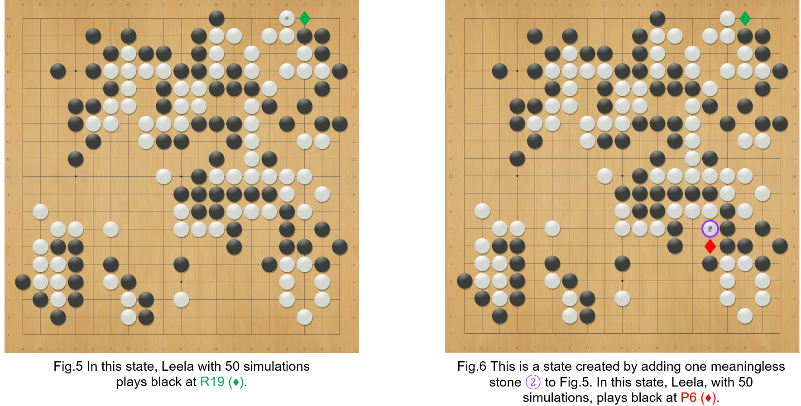
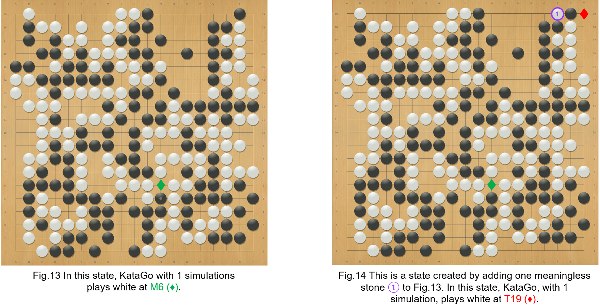
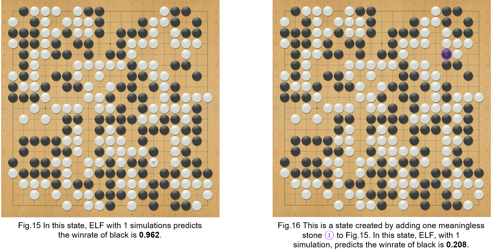

# Adversarial Example of Go
------
## Overview
This repository contains a reference implementation of finding adversarial examples for Go Agents. Our paper is accepted by Neurips 2022. 

In our paper, we attack famous Go agents like [KataGo](https://github.com/lightvector/KataGo), [LeelaZero](https://github.com/leela-zero/leela-zero), [ELF](https://github.com/pytorch/ELF), and [CGI](https://arxiv.org/abs/2003.06212) by systematically finding states that the target agent plays an obvious incorrect move that even amateur human players can tell. Fig.2 shows one of the examples we found. 


In this state, KataGo agent, one of the best AZ agents, will want to play black at position $\color{red} \text{E11 ◆}$ instead of postion $\color{green} \text{E1 ◆}$ even after executing 50 MCTS simulations. Even amateur human players can tell that position $\color{green} \text{E1 ◆}$ is the best action since black can kill the white stones that are marked with blue triangle. We also list the node information of the MCTS first layer at the right of Fig. 2. The first colomn is the action of the node. The second colomn is the number of MCTS simulations of each node. The third colomn is the predicted winrate of each node. According to the list, we can see that KataGo did consider the position $\color{green} \text{E1 ◆}$. However, since the predicted winrate is low, KataGo stop exploring $\color{green} \text{E1 ◆}$ and keep exploiting  $\color{red} \text{E11 ◆}$. Besides making the agent outputs a wrong action, we also finds examples that makes the agent predict a wrong winrate. Fig. 3 4 show an example of attacking the winrate of Leela with 50 simulations. 


Both Fig. 3 and Fig. 4 are white's turn. The only difference is the black stone marked with $\color{#9933FF} \text{2}$. However, Leela outputs two totally different winrates on two states. Even amateur humans players can tell that one of the winrates is wrong since  the additional $\color{#9933FF} \text{ black stone}$ shouldn't change the winrate.  

Our method is inspired by [adversarial attack](https://arxiv.org/pdf/1412.6572.pdf), which creates adversarial examples by minimally perturbing a natural example. For example, in the domain of image classification, researchers make the target model make a wrong prediction by adding some human imperceptible noise. Similar to other adversarial attack, Fig. 2 is created by a adding $\color{#9933FF} \text{two stones (marked as 1 and 2)}$ to a nature state (Fig. 1) of AlphaGo Zero self-play record. Even amateur players know that the $\color{#9933FF} \text{two stones}$ are meaningless since they will not affect the winrate nor the best action of the state in Fig 1. 
However, confused by those two stones, KataGo will switch its answer from $\color{green} \text{E1 ◆}$ to $\color{red} \text{E11 ◆}$. 
To find the examples show in Fig. 2 and Fig.4, we carefully designed the constraints on perturbed states during the search so that they are semantically similar to the original states and are also easy enough for human players to verify the correct move. Next, we test AZ agents with thousands of these perturbed
states to they make a trivial mistake. We also design an efficient algorithm to make the testing faster. Normally, our method is 100 times faster than brute force search. The following table shows the results of attacking KataGo with AlphaGo Zero self-play games.

The first column shows the number of MCTS simulations used by KataGo. The second and the third columns show the success rate of making KataGo outputs a bad action. The third and forth columns shows the success rate of make KataGo outputs a wrong winrate. We can see that as the number of simulations increase, KataGo becomes harder to attack. However, even with 50 simluations, we can still finds policy adversarial examples on 68% of the AlphaGo Zero self-play games. 

 

Our codes also aims to be a useful and lightweight analyze tool for Go players and developers, and supports the following features:
- Able to conduct our attack on Go program that supports GTP (https://senseis.xmp.net/?GoTextProtocol). 
- Able to save and load the MCTS and NN results of a program.
- Allowing different agents to compete against each other and store the result in SGF file.


## Setup


```bash
git clone git@github.com:lan-lc/adversarial_example_of_Go.git
cd adversarial_example_of_Go
sudo docker run --gpus all --network="host" --ipc=host -it -v=$PWD:/workspace kds285/go-attack
mkdir build
cd build
cmake ..
make -j
```
### KataGo
```bash
# run container
sudo docker run --gpus all --network="host" --ipc=host -it kds285/katago
# run program with gogui-server
gogui-server -port 9999 -loop "./katago gtp -model kata1-b40c256-s9948109056-d2425397051.bin.gz -config gtp_example.cfg"
# run program (20 blocks) with gogui-server
gogui-server -port 9999 -loop "./katago gtp -model kata1-b20c256x2-s5303129600-d1228401921.bin.gz -config gtp_example.cfg"
```
### Leela
```bash
# run container
sudo docker run --network="host" --ipc=host -it kds285/leelazero:go_attack
# run program with gogui-server
echo "./leelaz --gtp --threads 1 --noponder --visits 800 --resignpct 0 --timemanage off --gpu \$1 2>/dev/null" > run_gtp.sh
chmod +x run_gtp.sh
gogui-server -port 9998 -loop "./run_gtp.sh 0"
```
### ELF
```bash
# run container
sudo docker run --network="host" --ipc=host -it kds285/elf-opengo:go_attack
# run program with gogui-server
echo "./gtp.sh /go-elf/ELF/pretrained-go-19x19-v2.bin --verbose --gpu \$1 --num_block 20 --dim 256 --mcts_puct 1.50 --batchsize 8 --mcts_rollout_per_batch 8 --mcts_threads 2 --mcts_rollout_per_thread 400 --resign_thres 0 --mcts_virtual_loss 1 2>&1 | grep --line-buffered \"^= \|custom_output\" | awk '{ if(\$1==\"[custom_output]\") { print \$0; } else { print \$0\"\n\"; system(\"\"); } }'" > run_gtp.sh
chmod +x run_gtp.sh
gogui-server -port 9997 -loop "./run_gtp.sh 0"
```
### CGI
```bash
sudo docker --network="host" --ipc=host -it kds285/cgigo:go_attack
# build program
./scripts/setup-cmake.sh release caffe2 && make -j
# run program with gogui-server
gogui-server -port 9999 "Release/CGI -conf_file cgi_example.cfg"
```

## Adversarial examples
The following pictures show some of the adversarial examples we found. For each pair of pictures, the left is the nature state and the right is the perturbed stated. 







