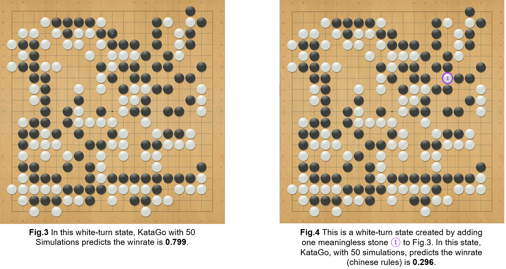

## 簡介

最近幾年，許多AI (如 KataGo, Leela Zero) 的棋力都有遠超職業棋士。大部分的職業棋士現在都會用 AI 去分析各種盤面的勝率和最佳步，並相信大部分的AI給出的答案。 
然而這些AI是否就真的不會犯一些簡單到連業餘棋手都能指認的錯誤呢？
在我們的論文中，我們透過系統性的尋找常用的 AI (KataGo, Leela Zero, ELF, CGI) 會犯錯的盤面。我們方法的靈感來自於 adversarial attack。
在 adversarial attack 中，人們會透過稍微改動一些正常的圖片，使得AI無法正常進行判斷，即使改動過後的圖片在意義上對人類而言是跟原本一樣的。

參照 adversarial attack，給定一個正常AI知道最佳步的盤面，我們會試著透過加上一兩個不影響盤面的子來攻擊AI。
如果加完無意義的子後，AI 會下出連業餘棋手都看得出來是錯的步，那我們就算攻擊成功。
圖二 (Fig. 2) 展示了一個我們攻擊成功的例子 (adversarial example)。

圖二是由圖一加上兩個沒意義的子 $\color{#9933FF} \text{1}$ 和 $\color{#9933FF} \text{2}$ 所產生的。
圖一圖二都是輪到黑而且最佳步皆為 $\color{green} \text{E1 ◆}$，
因為黑下在 $\color{green} \text{E1 ◆}$ 後，就算白的把含E1的四顆黑子吃掉，黑棋也可以再次下在E1破眼，從而殺了整條白棋 (三角形標記)。
這種簡單的死活問題是一般業餘棋手都會的，然而KataGo，最強的AI之一，在考慮過五十個變化 (MCTS simulations) 後，
選擇把黑下在 $\color{red} \text{E11 ◆}$ 去救四顆黑子 (方格標記) 從而放棄了殺更多白棋 (三角形標記) 的機會。
為了了解為何 KataGo 會做出這樣的選擇，我們列了KataGo搜尋的結果在圖二旁。第一行 (column) 是 KataGo 考慮了哪些步。
第二行是KataGo針對該步想了幾種變化。第三行是KataGo在想過各種變化後預測的勝率。
可以看到，KataGo是有考慮過下在 $\color{green} \text{E1 ◆}$。
但是KataGo只有考慮過一次，而且該次的預測勝率很低 (0.177)。因此KataGo
沒有繼續考慮該步而是繼續思考關於 $\color{red} \text{E11 ◆}$ 的各種變化。

除了尋找那些會讓AI給出錯誤最佳步的盤面，我們也尋找那些會讓AI預測錯誤勝率的盤面。圖三四就是其中一個我們找的例子。

圖四是由圖三加上一個沒有意義的子 $\color{#9933FF} \text{2}$ 所產生的。
圖三圖四都是輪到白棋下。然而KataGo在分別考慮過五十個變化 (MCTS simulations) 後，
認為圖三白的勝率是0.799而圖四白的勝率是0.296。
就算是圍棋新手也看得出來額外多加的 $\color{#9933FF}\text{黑子}$ 不應該影響勝率，
從而得知KataGo對於圖三和圖四的勝率預測一定錯了一個。更多的例子展示在 [Adversarial Examples](#adversarial-examples)。

為了尋找以上這些例子，我們在論文中透過小心的加上不會影嚮勝率也不會改變最佳步的子來產生上萬個不同的盤面。
接著我們用這些盤面試圖攻擊我們想攻擊的AI。如果該AI給出了一個明顯有錯的答案，那那我們就算找到一個例子。
為了減少搜尋時間，我們有提出一個新的演算法。該演算法在一般情況下都能至少加速超過一百倍。
下表展示了我們透過變更AlphaGo Zero自我對役的盤面來攻擊KataGo的結果。

上表的第一行 (first column) 表示了KataGo可以搜尋的盤面數量。數量越多，KataGo越強。
第二三行表示了我們對每一局棋譜找到一個盤面使得KataGo下出連業餘棋手都看的錯誤的機率。
可以看到，單是多加一個子，就在21%的棋譜中找到能讓KataGo在考慮過50個盤面後還是錯了的例子。而當我們加到兩個子，攻擊成功率上升到68%。
第四五行則表示了讓KataGo給出錯誤勝率的攻擊成功率。可以看到一樣很容易成功。

除了展現我們論文中的方法，我們希望透過開源我們的程式使得更多人能方便分析比較圍棋AI。
我們的程式有下面幾個特點:
- 輕便
- 可透過GTP(https://senseis.xmp.net/?GoTextProtocol)協定同時與多個程式溝通。就算是在不同台電腦也行。
- 能把這次算過的結果存下來。之後如果又一樣的盤面可以直接讀取。
- 能把分析的結果存成SGF檔案。

## Adversarial Examples
以下幾個圖展示了六個我們找到的例子。每一個例子有兩個盤面。左邊是原始正常盤面。右邊是加了一兩個子後的盤面。
更多例子在 [examples](https://github.com/lan-lc/adversarial_example_of_Go/tree/main/examples)檔案中。

