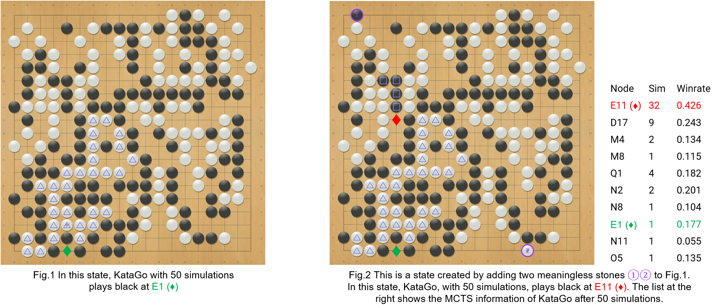

## 簡介

最近幾年，許多AI (如 KataGo, Leela Zero) 的棋力都有遠超職業棋士。大部分的職業棋士現在都會用 AI 去分析各種盤面的勝率和最佳步，並相信大部分的AI給出的答案。 
然而這些AI是否就真的不會犯一些簡單到連業餘棋手都能指認的錯誤呢？
在我們的論文中，我們透過系統性的尋找常用的 AI (KataGo, Leela Zero, ELF, CGI) 會犯錯的盤面。我們方法的靈感來自於 adversarial attack。
在 adversarial attack 中，人們會透過稍微改動一些正常的圖片，使得AI無法正常進行判斷，即使改動過後的圖片在意義上對人類而言是跟原本一樣的。

參照 adversarial attack，給定一個正常AI知道最佳步的盤面，我們會試著透過加上一兩個不影響盤面的子來攻擊AI。
如果加完無意義的子後，AI 會下出連業餘棋手都看得出來是錯的步，那我們就算攻擊成功。
圖二 (Fig. 2) 展示了一個我們攻擊成功的例子 (adversarial example)。

圖二是由圖一加上兩個沒意義的子 $\color{#9933FF} \text{1}$ 和 $\color{#9933FF} \text{2}$ 所產生的。
圖一圖二都是輪到黑而且最佳步皆為 $\color{green} \text{E1 ◆}$，
因為黑下在 $\color{green} \text{E1 ◆}$ 後，就算白的把含E1的四顆黑子吃掉，黑棋也可以再次下在E1破眼，從而殺了整條白棋 (三角形標記)。
這種簡單的死活問題是一般業餘棋手都會的，然而KataGo，最強的AI之一，在考慮過五十個變化 (MCTS simulations) 後，
選擇把黑下在 $\color{red} \text{E11 ◆}$ 去救四顆黑子 (方格標記) 從而放棄了殺更多白棋 (三角形標記) 的機會。
為了了解為何 KataGo 會做出這樣的選擇，我們列了KataGo搜尋的結果在圖二旁。第一行 (column) 是 KataGo 考慮了哪些步。
第二行是KataGo針對該步想了幾種變化。第三行是KataGo在想過各種變化後預測的勝率。
可以看到，KataGo是有考慮過下在 $\color{green} \text{E1 ◆}$。
但是KataGo只有考慮過一次，而且該次的預測勝率很低 (0.177)。因此KataGo
沒有繼續考慮該步而是繼續思考關於 $\color{red} \text{E11 ◆}$ 的各種變化。

除了尋找那些會讓AI給出錯誤的最佳步盤面，我們也

$\color{red} \text{E11 ◆}$  $\color{green} \text{E1 ◆}$ 
$\color{#9933FF} \text{2}$

